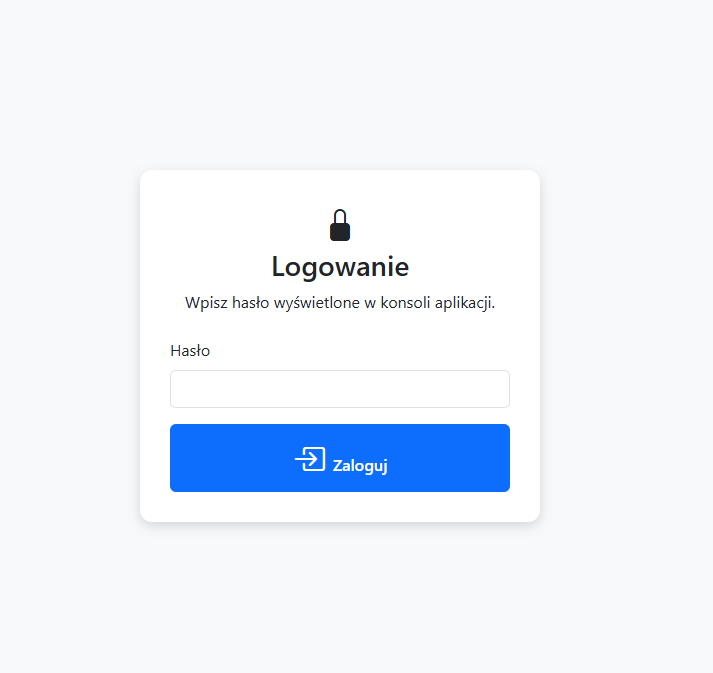
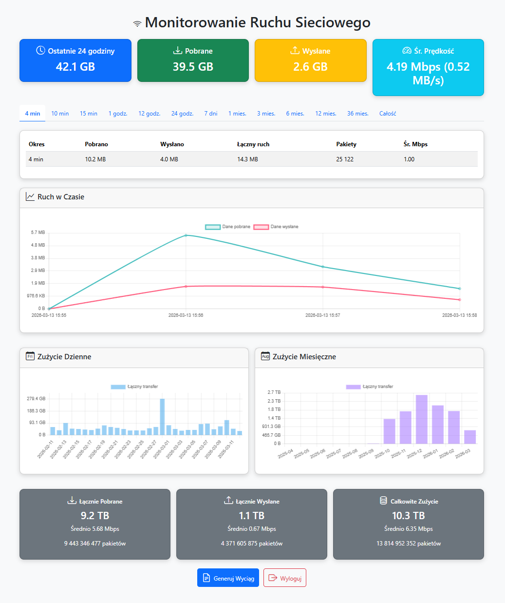

# MikroTik Traffic Monitor

A web application for monitoring data transfer (RX/TX), packets, and generating reports for a selected time range. The project was built with the little help of AI.

> **Disclaimer:**
> This project is **not affiliated** with MikroTik. All product names and trademarks are the property of their respective owners.

---

## Security Warning

This solution is designed primarily for **local network** use.

- By default, it does **not** include full internet-facing hardening.
- There is no built-in HTTPS layer (TLS should be terminated by a reverse proxy).
- It is **not recommended** to expose the application directly to the internet.

If you want to make the app remotely accessible, use a **VPN** (most secure), or use a tunnel such as **Cloudflared**.

---

## Screenshots

### Login screen


### Dashboard


---

## Features

- token-based login
- automatic scheduler that collects traffic statistics
- transfer summaries for different ranges (min/h/d/m/all)
- traffic charts (time series, daily, monthly)
- report generation for a specified date range

---

## Architecture

The project uses a layered architecture:

- `app/main.py` — starts the FastAPI application and manages lifecycle
- `app/config.py` — environment configuration
- `app/db.py`, `app/models.py` — database layer (SQLAlchemy)
- `app/auth.py` — token and authorization logic
- `app/routers/` — API endpoints and pages
- `app/services/` — domain logic (traffic, scheduler, RouterOS integration)
- `templates/`, `static/` — UI layer (HTML/CSS/JS) using Bootstrap, Chart.js, and Bootstrap Icons

---

## Requirements

- Python 3.11+
- MySQL/MariaDB
- access to a statistics RouterOS v7 API

---

## RouterOS User Setup

This app connects to RouterOS using the API. It is recommended to create a dedicated user group with limited permissions and assign a dedicated API user to that group.

Example commands:

```shell
/user group add name=datausageonly policy=read,api,!local,!telnet,!ssh,!ftp,!reboot,!write,!policy,!test,!winbox,!web,!sniff,!sensitive,!romon,!rest-api
/user add name=datausage group=datausageonly password=<secure password>
```

---

## Environment Variables

The application reads configuration from a `.env` file.

- `APP_NAME` — application title (FastAPI)
- `APP_DESCRIPTION` — application description (FastAPI)
- `DB_USER`, `DB_PASSWORD`, `DB_HOST`, `DB_PORT`, `DB_NAME` — MySQL/MariaDB connection
- `ROUTER_HOST`, `ROUTER_API_PORT`, `ROUTER_USERNAME`, `ROUTER_PASSWORD` — credentials for the router statistics API
- `LTE_NR_INTERFACE` — the interface name used to collect counters
- `USE_SSL` — whether to use SSL when connecting to the router API
- `SECRET_KEY` — secret used to sign JWTs (must be strong)
- `ACCESS_TOKEN_ALGORITHM` — JWT algorithm
- `ACCESS_TOKEN_EXPIRE_DAYS` — login token expiration (in days)

---

## Running Locally

1. Configure MySQL/MariaDB.
2. Create and activate a virtual environment.
3. Install project dependencies.
4. Fill in `.env`.
5. Start the application server (e.g., Uvicorn).

Example:

```bash
python -m venv .venv
source .venv/bin/activate
# pip install -r requirements.txt
# fill in .env
uvicorn app.main:app --host 127.0.0.1 --port 8000 --reload
```

Then open: `http://localhost:8000`.

---

## License

This project is licensed under **MIT**. See [LICENSE](LICENSE).